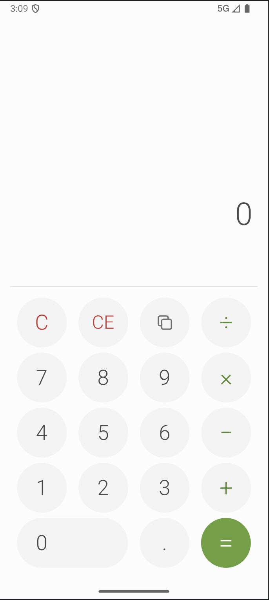
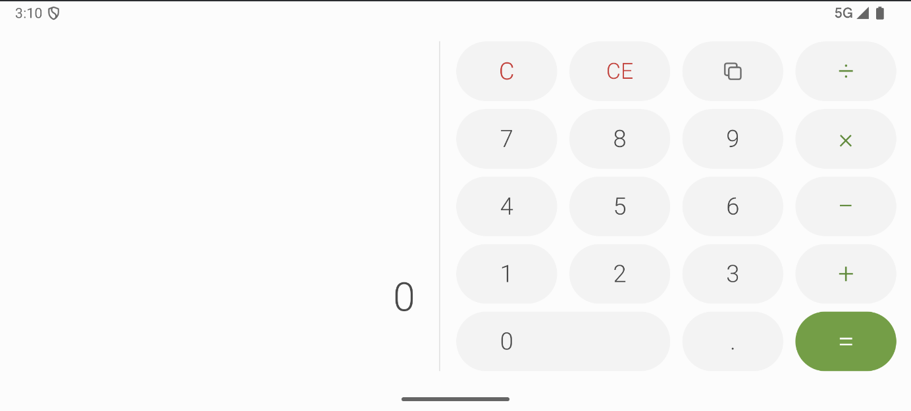
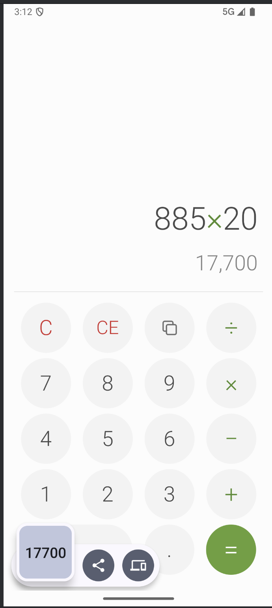

# Калькулятор (Android, ДЗ №1)

Простой калькулятор на Kotlin и Jetpack Compose в стиле дизайн-системы **Leaf**. Считает в `double`, работает в портретной и альбомной ориентации и не теряет ввод при повороте. Результат можно скопировать в буфер обмена.

<!-- Скриншот: портретная ориентация, на дисплее выражение и превью результата (например, 89,552÷620.5) -->

  

## Как выглядит

Экран делится на две части: сверху дисплей, снизу клавиатура 4×5 из круглых кнопок.

- **Дисплей.** В верхней строке выражение целиком: левый операнд, знак операции (зелёный) и число, которое набирается сейчас, например `89,552÷620.5`. После `=` в этой строке остаётся результат. Под ней серым показывается превью результата, пока набирается правый операнд. Длинные числа уменьшаются по ширине экрана и не переносятся.
- **Клавиатура.**

  | | | | |
  |:-:|:-:|:-:|:-:|
  | `C` | `CE` | Копировать | `÷` |
  | `7` | `8` | `9` | `×` |
  | `4` | `5` | `6` | `−` |
  | `1` | `2` | `3` | `+` |
  | `0` (двойная) | | `.` | `=` |

  `C` и `CE` красные, знаки операций зелёные, `=` залита зелёным.

  `CE` стирает только набираемое число, операция остаётся: `12+34` → `CE` → `12+`. Отрицательное число вводится минусом в начале ввода или сразу после знака операции: `−5+3`, `5×−3`.

<!-- Скриншот: альбомная ориентация -->

  

В альбомной ориентации дисплей слева, а клавиатура справа, кнопки становятся «таблетками». Весь набранный ввод сохраняется при повороте.

Всё считается строго по правилам `double`: `1÷0` = `Infinity`, `−1÷0` = `-Infinity`, `0÷0` = `NaN`, переполнение тоже даёт `Infinity`. Приложение не падает, следующая цифра начинает новый ввод.

<!-- Скриншот: копирование результата (кнопка «Копировать» или долгое нажатие на дисплей) -->

  

Результат копируется кнопкой «Копировать» или долгим нажатием на дисплей. На Android 12L и старше появляется toast, на Android 13+ система сама показывает превью буфера обмена.
