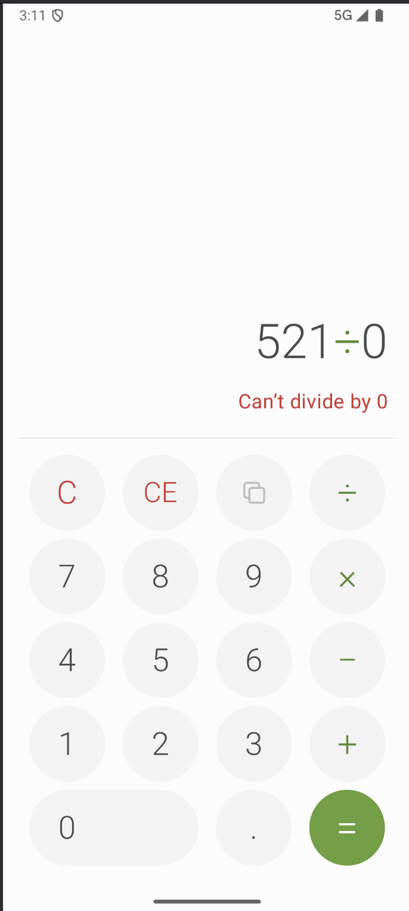

# Калькулятор (Android, ДЗ №1)

Простой калькулятор на Kotlin и Jetpack Compose в стиле дизайн-системы **Leaf**. Считает в `double`, работает в портретной и альбомной ориентации и не теряет ввод при повороте. Результат можно скопировать в буфер обмена.

<!-- Скриншот: портретная ориентация, на дисплее выражение и превью результата (например, 89,552÷620.5) -->
<p align="center">
  
</p>

## Как выглядит

Экран делится на две части: сверху дисплей, снизу клавиатура 4×5 из круглых кнопок.

- **Дисплей.** В верхней строке выражение целиком: левый операнд, знак операции (зелёный) и число, которое набирается сейчас, например `89,552÷620.5`. После `=` в этой строке остаётся результат. Под ней серым показывается превью результата, пока набирается правый операнд. Длинные числа уменьшаются по ширине экрана и не переносятся.
- **Клавиатура.**

  | | | | |
  |:-:|:-:|:-:|:-:|
  | `C` | `CE` | Копировать | `÷` |
  | `7` | `8` | `9` | `×` |
  | `4` | `5` | `6` | `−` |
  | `1` | `2` | `3` | `+` |
  | `0` (двойная) | | `.` | `=` |

  `C` и `CE` красные, знаки операций зелёные, `=` залита зелёным.

<!-- Скриншот: альбомная ориентация -->
<p align="center">
  
</p>

В альбомной ориентации дисплей слева, а клавиатура справа, кнопки становятся «таблетками». Весь набранный ввод сохраняется при повороте.

<!-- Скриншот: ошибка деления на ноль -->
<p align="center">
  
</p>

При делении на ноль выражение остаётся на экране, под ним красным выводится «Can’t divide by 0». Приложение не падает. Следующая цифра начинает новый ввод.

<!-- Скриншот: копирование результата (кнопка «Копировать» или долгое нажатие на дисплей) -->
<p align="center">
  
</p>

Результат копируется кнопкой «Копировать» или долгим нажатием на дисплей. На Android 12L и старше появляется toast, на Android 13+ система сама показывает превью буфера обмена.

## Кнопки

| Кнопка | Что делает |
|---|---|
| `0`–`9`, `.` | ввод числа (не больше 15 цифр, одна точка) |
| `+ − × ÷` | операция. Если правый операнд уже набран, сначала считается предыдущая операция (`2+3×` → `5×`) |
| `=` | вычислить |
| `C` | сбросить всё |
| `CE` | стереть только набираемое число, операция сохраняется |
| Копировать | скопировать результат в буфер. Кнопка неактивна, когда копировать нечего |

Результат выводится с точностью до 12 значащих цифр, поэтому `0.1+0.2` даёт `0.3`, а не `0.30000000000000004`. Очень большие и очень маленькие числа показываются в экспоненциальной записи. Если результат выходит за пределы `double`, выводится «Result is too large».

## Требования к ДЗ и их выполнение

| Требование | Как выполнено |
|---|---|
| Считает в `double` | вся арифметика в `Double` ([Calculator.kt](app/src/main/java/ru/itmo/calculator/Calculator.kt)) |
| Клавиатура (например, 3×5) | 4×5: цифры, точка, 4 операции, `=`, `C`, `CE`, «Копировать» |
| Кнопка сброса `C` | есть, сбрасывает всё |
| Нет потери значений при повороте | состояние хранится в `rememberSaveable` со своим `Saver` |
| Поворот не заблокирован | в манифесте нет `screenOrientation`, для landscape отдельная раскладка |
| Нет падений | деление на ноль и переполнение показываются как ошибки. Логика покрыта юнит-тестами |
| Не открывается стандартная клавиатура | на экране нет полей ввода, ввод только кнопками |
| Пакет и `applicationId` без `com.example` | `ru.itmo.calculator` |
| Автотест находит элементы | корневой `Scaffold` с `semantics { testTagsAsResourceId = true }`, строка результата с `testTag("result")` |

## Запуск в Android Studio

1. Клонировать репозиторий: `git clone <url>`
2. `File → Open` и выбрать папку проекта
3. Дождаться Gradle Sync (нужен интернет; если студия предложит установить Android SDK 36, согласиться)
4. Выбрать устройство (телефон с включённой отладкой по USB или эмулятор)
5. Нажать ▶ Run `app`

Нужны Android Studio Meerkat (2024.3.1) или новее и JDK 17 (подходит встроенный JBR). Минимальная версия Android — 8.0 (API 26).

## Сборка из командной строки

```
./gradlew testDebugUnitTest lintDebug assembleDebug   # APK: app/build/outputs/apk/debug/app-debug.apk
```

## Структура

- `Calculator.kt` — логика в виде неизменяемого `CalculatorState`, без зависимостей от Android, покрыта юнит-тестами
- `DisplayFormat.kt` — разбиение на разряды для дисплея
- `CalculatorScreen.kt` — UI на Compose: дисплей, клавиатура, раскладки для портрета и альбомной ориентации, копирование
- `Theme.kt` — цвета Leaf
- `MainActivity.kt` — `setContent` и edge-to-edge
